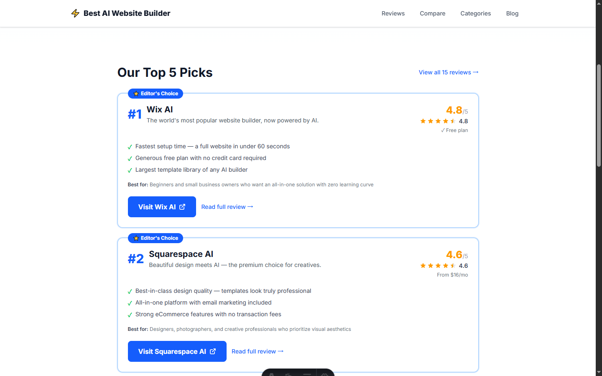
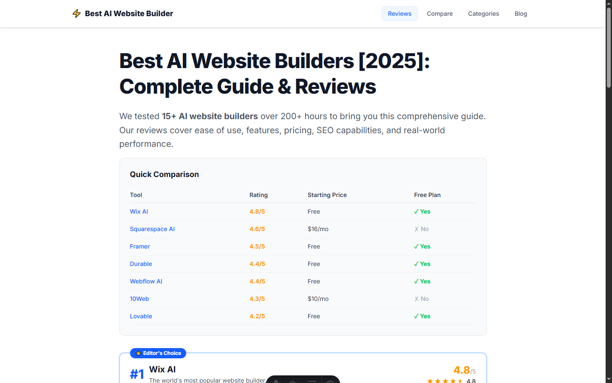
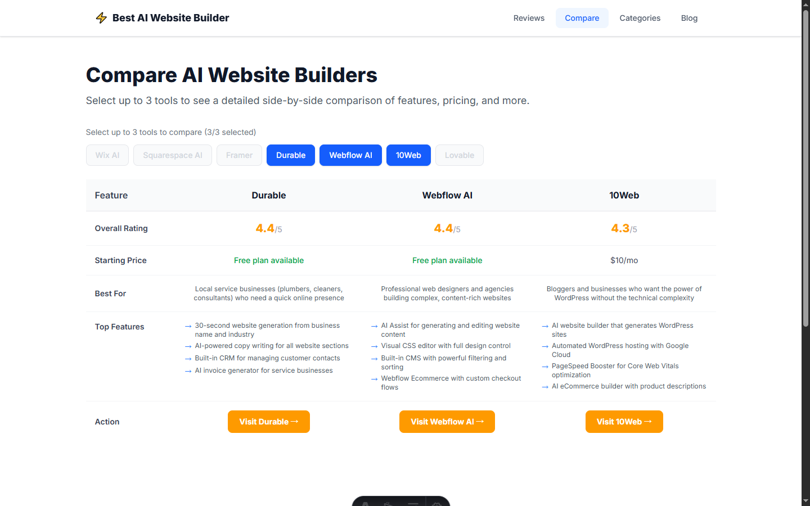
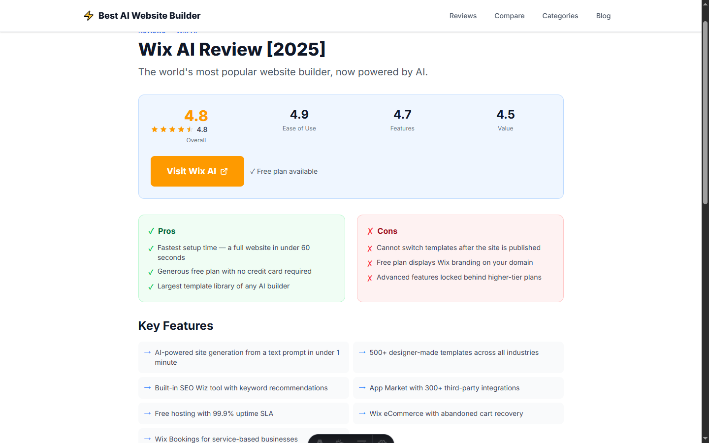

# Best AI Website Builder

A comprehensive review and comparison website for AI website builders, built with [Astro](https://astro.build). Features independent, in-depth reviews of popular AI website building tools with side-by-side comparison capabilities, search, and educational content.

## 🖼️ Screenshots

| Homepage | Reviews List |
|----------|-------------|
|  |  |

| Tool Comparison | Review Detail |
|-----------------|---------------|
|  |  |

## Features

- **Expert Reviews** - Deep-dive reviews of 7 popular AI website builders based on hands-on testing
- **Comparison Tool** - Interactive side-by-side comparison of up to 3 tools (React-powered)
- **Live Search** - Real-time search and filter tools by name or use case
- **Category Filtering** - Browse tools by category: Blog, E-commerce, Portfolio, Free Options
- **Blog & Resources** - Methodology guides, industry insights, vibe coding guides, and educational content
- **SEO Optimized** - Complete Schema.org structured data, sitemap, RSS, and Open Graph support
- **Affiliate Integration** - Transparent affiliate links with proper disclosure

## Tech Stack

| Technology | Version | Purpose |
|------------|---------|---------|
| [Astro](https://astro.build) | 6.0.8 | Static site generator & web framework |
| [Tailwind CSS](https://tailwindcss.com) | 4.2.2 | Utility-first CSS framework |
| [React](https://react.dev) | 19.2.4 | Interactive components (comparison table, search) |
| [Lucide React](https://lucide.dev) | 0.577.0 | Icon library |
| [Astro React](https://docs.astro.build/en/guides/integrations-guide/react/) | 5.0.1 | React integration for Astro |
| [Astro Sitemap](https://docs.astro.build/en/guides/integrations-guide/sitemap/) | 3.7.1 | Automatic sitemap generation |
| [Astro RSS](https://docs.astro.build/en/guides/rss/) | 4.0.17 | RSS feed generation |

## Project Structure

```
/
├── public/                      # Static assets (images, favicons, robots.txt)
├── imgs/                        # Screenshots for README
├── src/
│   ├── components/              # UI Components
│   │   ├── layout/              # Layout components
│   │   │   ├── Header.astro     # Site navigation header
│   │   │   ├── Footer.astro     # Site footer with links & disclosure
│   │   │   └── StickyBar.astro  # Sticky notification bar
│   │   ├── review/              # Review-specific components
│   │   │   ├── ToolCard.astro   # Tool preview card (used in lists)
│   │   │   ├── RatingStars.astro # Star rating display
│   │   │   ├── ProsConsList.astro # Pros/cons list component
│   │   │   └── PricingTable.astro # Pricing information table
│   │   ├── seo/                 # SEO components
│   │   │   ├── SeoHead.astro    # Meta tags & structured data
│   │   │   └── BreadcrumbNav.astro # Breadcrumb navigation
│   │   ├── CompareTable.tsx     # React component for tool comparison
│   │   ├── ToolSearch.tsx       # React component for live tool search
│   │   ├── AffiliateBtn.astro   # Affiliate link button with disclosure
│   │   └── FaqSection.astro     # FAQ accordion component
│   ├── content/                 # Content collections
│   │   ├── tools/               # Tool review content (Markdown with YAML frontmatter)
│   │   │   ├── wix-ai.md
│   │   │   ├── squarespace-ai.md
│   │   │   ├── durable.md
│   │   │   ├── framer.md
│   │   │   ├── 10web.md
│   │   │   ├── webflow-ai.md
│   │   │   └── lovable.md
│   │   └── blog/                # Blog articles
│   │       ├── methodology.md
│   │       ├── welcome.md
│   │       └── what-is-vibe-coding.md
│   ├── layouts/                 # Page layout templates
│   │   ├── BaseLayout.astro     # Base layout with header/footer
│   │   ├── ReviewLayout.astro   # Layout for review pages
│   │   └── BlogLayout.astro     # Layout for blog pages
│   ├── pages/                   # Route pages (file-based routing)
│   │   ├── index.astro                     # Homepage
│   │   ├── best-ai-website-builder/        # Full review list page
│   │   ├── best-ai-website-builder-2025/   # 2025-specific reviews
│   │   ├── comparison/                     # Tool comparison page
│   │   ├── developer-tools/                # Developer tools page
│   │   ├── review/[slug].astro             # Individual tool review (dynamic route)
│   │   ├── blog/                           # Blog list & articles
│   │   ├── category/[slug].astro           # Category pages (dynamic)
│   │   ├── methodology/                    # Review methodology page
│   │   ├── glossary/                       # Terms glossary
│   │   ├── about/                          # About us page
│   │   └── rss.xml.js                      # RSS feed endpoint
│   ├── styles/
│   │   └── global.css           # Global styles & Tailwind imports
│   └── utils/
│       ├── constants.ts         # Site constants (name, URL, descriptions)
│       ├── format.ts            # Formatting utilities
│       └── seo.ts               # Schema.org structured data generators
├── astro.config.mjs             # Astro configuration
├── package.json                 # Dependencies & scripts
├── tsconfig.json                # TypeScript configuration
└── README.md                    # This file
```

## Content Schema

Tool reviews are stored as Markdown files with YAML frontmatter in `src/content/tools/`:

```yaml
---
name: "Wix AI"                          # Tool display name
slug: "wix-ai"                          # URL-friendly identifier
logo: "../../public/images/tools/wix-logo.png"  # Logo path
tagline: "The world's most popular website builder..."
rating: 4.8                             # Overall rating (0-5)
ratingBreakdown:                        # Detailed ratings
  easeOfUse: 4.9
  features: 4.7
  pricing: 4.5
  seoFriendly: 4.6
price:
  freePlan: true                        # Has free tier?
  startingPrice: 17                     # Starting monthly price
  currency: "USD"
features:                               # Key features list
  - "AI-powered site generation..."
  - "500+ designer-made templates..."
pros:                                   # Pros list
  - "Fastest setup time..."
  - "Generous free plan..."
cons:                                   # Cons list
  - "Cannot switch templates..."
  - "Free plan displays branding..."
bestFor: "Beginners and small business owners..."  # Target audience
affiliateLink: "https://www.wix.com/..."  # Affiliate URL
categories: ["blog", "ecommerce", "portfolio"]  # Categories
datePublished: 2025-01-15               # First published
dateModified: 2025-03-01                # Last updated
featured: true                          # Editor's choice badge?
---

## Markdown Content

Full review content goes here in Markdown format...
```

## Available Scripts

All commands run from the project root:

| Command | Action |
|---------|--------|
| `npm install` | Install dependencies |
| `npm run dev` | Start dev server at `localhost:4321` |
| `npm run build` | Build production site to `./dist/` |
| `npm run preview` | Preview production build locally |
| `npm run astro ...` | Run Astro CLI commands |

## SEO Features

- **Schema.org Structured Data**
  - `Review` schema for individual tool pages
  - `ItemList` schema for ranking pages
  - `FAQPage` schema for FAQ sections
  - `WebSite` schema for homepage
- **Automatic Sitemap** - Generated at `/sitemap-index.xml`
- **RSS Feed** - Available at `/rss.xml`
- **Open Graph & Twitter Cards** - Rich social media previews
- **Canonical URLs** - Proper canonicalization for SEO
- **Breadcrumb Navigation** - Structured breadcrumb trails

## Deployment

Build output is generated in `./dist/` as a static site. Deploy to any static hosting:

- [Vercel](https://vercel.com) - `vercel --prod`
- [Netlify](https://netlify.com) - Drag & drop dist folder
- [Cloudflare Pages](https://pages.cloudflare.com) - Connect Git repository
- [GitHub Pages](https://pages.github.com) - Use GitHub Actions

## Environment Requirements

- **Node.js**: >= 22.12.0
- **Package Manager**: npm (comes with Node.js)

## License

MIT © 2025 Best AI Website Builder

---

*Disclosure: This site contains affiliate links. We may earn a commission when you click our links and make a purchase. This does not affect our editorial independence or review scores.*
